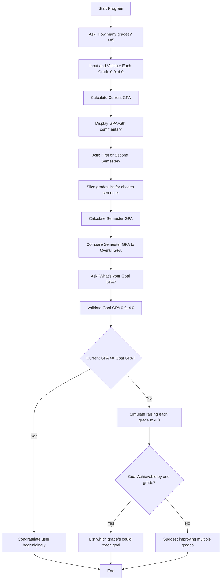

[](https://classroom.github.com/open-in-codespaces?assignment_repo_id=21163949)
# Passive-Aggressive GPA Calculator

Because apparently adding and dividing numbers was too much work.

This Python script calculates your GPA, analyzes your semester performance, and checks whether your dream GPA is even remotely achievable. It’s fully functional, slightly judgmental, and very aware that it’s doing your math for you.

---

## Features

- **Grade Input with Validation**  
  Prompts for grades on a 4.0 scale and politely points out mistakes when you can’t follow directions.

- **Automatic GPA Calculation**  
  Computes your GPA so you don’t have to.

- **Semester Comparison**  
  Uses slicing to see if you actually improved or if things just went downhill.

- **Goal GPA Simulation**  
  Asks for your target GPA and checks whether you can reach it by fixing just one class. Spoiler: probably not.

---

## How It Works (Flowchart)



---

## Example Run

```
Welcome to the GPA Calculator—because you can’t do basic math yourself.
How many grades do you want to enter? (at least 5, hopefully you can count): 5
Enter grade #1: 3.3
Enter grade #2: 3.7
Enter grade #3: 2.5
Enter grade #4: 3.0
Enter grade #5: 2.0

Crunching the numbers you could’ve easily done yourself...
Based on 5 classes, your GPA is: 2.90. Not bad, I guess.

Do you want to look at the 'first' or 'second' half of your classes? second
Your second semester GPA is: 2.50.
Yikes. Seems like motivation took a vacation that semester.

What’s your goal GPA (0.0 - 4.0)? 3.5
Oof. Even if you magically turned one grade into a 4.0, you’d still miss your goal GPA of 3.50.
Might want to start doing your homework… just a thought.
```

---

## Requirements

- Python 3.7 or higher  
- A terminal or command prompt  
- Basic literacy in following instructions  

---

## How to Run

1. Save the script as `gpa_calculator.py`
2. Open your terminal
3. Run the following command:
   ```bash
   python gpa_calculator.py
   ```
4. Follow the prompts
5. Pretend you weren’t insulted by a Python script

---

## License

Use, modify, and share freely. Just don’t remove the sarcasm. It’s the only thing holding this together.

---

## Author

Written by a mildly disappointed Python program.
